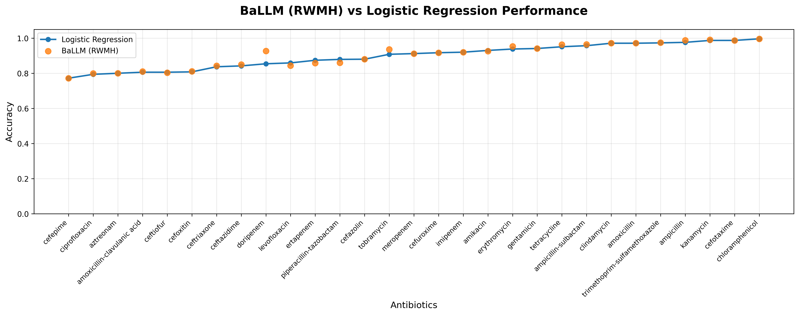

# BaLLM: Bayesian Large Language Model Framework


[Project Website](https://beckyvan156.github.io/BaLLM-final/) | [Paper (coming soon)]()

---

## Overview

Antimicrobial resistance (AMR) is a growing global health crisis. Predicting antibiotic resistance from whole-genome sequencing (WGS) data is critical for clinical decision-making, but current approaches either rely on manually curated databases like CARD that miss novel resistance mechanisms, or use machine learning models that lack interpretability and biological grounding.

BaLLM addresses this by combining large language models (LLMs) with Bayesian statistical modeling. First, LLMs (Gemini 1.5 Flash and DeepSeek) extract gene-antibiotic resistance associations from scientific literature, scoring each association as Strong, Moderate, Weak, or Against. These scores form a knowledge graph of 2,598 gene-antibiotic associations across 29 antibiotics. The knowledge graph then informs ordered priors in a Bayesian hierarchical logistic regression model, where genes with stronger evidence receive higher prior means.

On external validation datasets, BaLLM with RWMH sampling substantially outperforms standard logistic regression, achieving 84% accuracy vs 46% for cefepime and 85% vs 47% for meropenem on the Shelburne dataset.

---

## Pipeline


---

## Repository Structure

```
BaLLM/
├── code/
│   ├── bayesian_logistic_modeling.py   # Core Bayesian hierarchical model
│   ├── gemini.py                       # LLM response processing
│   ├── gemini_tune.py                  # LLM parameter tuning
│   ├── gemini_deepseek_KGmatrix.py     # Multi-stage evidence scoring
│   ├── kg_using_card.py                # CARD ontology KG construction
│   ├── kg_using_card_v2.py             # CARD KG construction (v2)
│   ├── logistic_regression.py          # Baseline logistic regression
│   ├── neo4j.py                        # Neo4j graph database interface
│   └── examples/
│       └── load_and_run_model.ipynb    # Quick start notebook
├── results/
│   ├── final_kg.csv                    # Knowledge graph (2,598 associations)
│   └── KG model parameters/            # Pre-trained model files (29 antibiotics)
├── data/                               # Input datasets
├── manuscript/                         # Paper figures
├── docs/                               # GitHub Pages site
├── requirements.txt
├── LICENSE
└── README.md
```

---

## Installation

```bash
git clone https://github.com/beckyvan156/BaLLM-final.git
cd BaLLM-final
pip install -r requirements.txt
```

**Note:** Requires Python 3.10+. PyMC requires a C compiler; see the [PyMC installation docs](https://www.pymc.io/projects/docs/en/latest/installation.html) for platform-specific instructions.

---

## Quick Start

See the notebook [`code/examples/load_and_run_model.ipynb`](code/examples/load_and_run_model.ipynb) for a complete walkthrough of loading pre-trained models and running predictions on new data.

```python
from code.examples.load_and_run_model import evaluate_all_antibiotics

results_df = evaluate_all_antibiotics(
    test_df_dict=shelburne_bayes_df_dict,
    model_dir="results/KG model parameters"
)
```

**Sample output (Shelburne dataset):**

| Antibiotic | % Resistant | Logistic Acc. | Bayesian Acc. |
|---|---|---|---|
| amikacin | 3.70% | 0.9722 | 0.9722 |
| cefepime | 27.32% | 0.4588 | 0.8402 |
| ceftazidime | 26.84% | 0.7684 | 0.8000 |
| meropenem | 15.18% | 0.4712 | 0.8534 |
| tobramycin | 2.78% | 0.9907 | 0.9722 |

---

## Code Description

| Script | Description |
|---|---|
| `bayesian_logistic_modeling.py` | Core Bayesian hierarchical model implementation. Defines ordered priors informed by LLM evidence scores, supports both NUTS and RWMH (Metropolis) samplers via PyMC. Includes data preparation, model fitting, and posterior prediction. |
| `gemini.py` | Processes LLM (Gemini) responses for knowledge graph construction. Handles structured question-answer extraction about gene-antibiotic resistance relationships. |
| `gemini_deepseek_KGmatrix.py` | Multi-stage evidence scoring pipeline using both Gemini and DeepSeek LLMs. Validates and scores gene-antibiotic associations as Strong (3), Moderate (2), Weak (1), or Against (-1). |
| `kg_using_card.py` / `kg_using_card_v2.py` | Constructs knowledge graphs from the CARD (Comprehensive Antibiotic Resistance Database) ontology for comparison with LLM-derived knowledge graphs. |
| `logistic_regression.py` | Baseline logistic regression model with Monte Carlo simulations for performance comparison against the Bayesian approach. |
| `neo4j.py` | Interface for storing and querying the knowledge graph in a Neo4j graph database. |

---

## Knowledge Graph

The knowledge graph ([`results/final_kg.csv`](results/final_kg.csv)) contains 2,598 gene-antibiotic associations across 29 antibiotics. Each entry has the following columns:

- **Key** -- Unique identifier for the gene-antibiotic pair
- **Score** -- Numeric evidence score
- **First Word** -- Evidence category: Strong, Moderate, Weak, or Against
- **antibiotic** -- Target antibiotic
- **gene** -- KEGG orthology ID

---

## Pre-trained Models

The [`results/KG model parameters/`](results/KG%20model%20parameters/) directory contains pre-trained models for 29 antibiotics. For each antibiotic, three files are provided:

- `{antibiotic}_posterior_params_2.5.npz` -- Bayesian posterior parameters (beta coefficients and intercept samples)
- `{antibiotic}_logistic_model.pkl` -- Fitted logistic regression model
- `{antibiotic}_gene_strength.csv` -- Gene list with evidence scores used for that antibiotic

**Supported antibiotics:** amikacin, amoxicillin, amoxicillin-clavulanic acid, ampicillin, ampicillin-sulbactam, aztreonam, cefazolin, cefepime, cefotaxime, cefoxitin, ceftazidime, ceftiofur, ceftriaxone, cefuroxime, chloramphenicol, ciprofloxacin, clindamycin, doripenem, ertapenem, erythromycin, gentamicin, imipenem, kanamycin, levofloxacin, meropenem, piperacillin-tazobactam, tetracycline, tobramycin, trimethoprim-sulfamethoxazole.

---

## Datasets

BaLLM was validated on six external datasets:

- **Shelburne** -- Clinical isolates from MD Anderson Cancer Center
- **ARIsolateBank** -- CDC Antibiotic Resistance Isolate Bank
- **CF** -- Cystic fibrosis isolates
- **German** -- German surveillance isolates
- **AstraZeneca** -- Pharmaceutical clinical trial isolates
- **Rabin** -- Rabin Medical Center isolates

---

## Results



**Key findings:**

- BaLLM with RWMH sampling outperforms standard logistic regression on most antibiotics.
- Largest improvements observed on cefepime (84% vs 46%) and meropenem (85% vs 47%).
- The LLM-derived knowledge graph provides biologically informed priors that improve prediction even when training data is limited.

---

## Citation

If you use BaLLM in your research, please cite:

```bibtex
@article{ballm2026,
  title={BaLLM: Bayesian Large Language Model Framework for Antibiotic Resistance Prediction},
  author={[Authors]},
  journal={[Journal]},
  year={2026}
}
```

---

## License

This project is licensed under the MIT License - see the [LICENSE](LICENSE) file for details.
