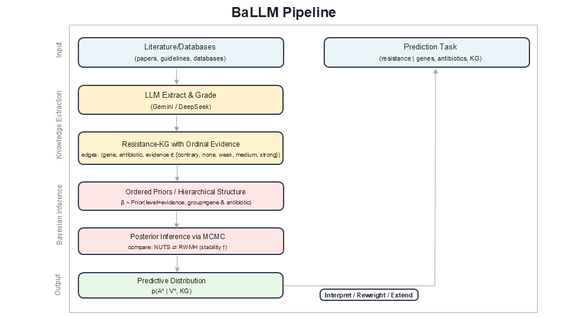

# BaLLM: Bayesian Large Language Model Framework

**Combining LLM-generated knowledge graphs with Bayesian hierarchical modeling to predict bacterial antibiotic resistance**

---

## The Problem

Antimicrobial resistance (AMR) is one of the most pressing global health threats of the 21st century. The World Health Organization has identified AMR as a top-ten threat to public health, and drug-resistant infections are projected to cause millions of deaths annually in the coming decades.

Current approaches to predicting antibiotic resistance from genomic data rely heavily on curated databases such as the **Comprehensive Antibiotic Resistance Database (CARD)**. While invaluable, these resources have fundamental limitations:

- **Expert curation bottleneck** -- Maintaining and expanding curated databases requires significant domain expertise and manual effort, limiting the pace at which new knowledge is incorporated.
- **Novel mechanisms are missed** -- Resistance mechanisms that have not yet been formally characterized and added to the database remain invisible to downstream prediction models.
- **Scalability challenges** -- Whole-genome sequencing (WGS) data is growing at an unprecedented rate, yet translating genotype to resistance phenotype remains a difficult prediction problem, especially for antibiotics with complex or polygenic resistance architectures.

There is a clear need for methods that can automatically extract and integrate resistance knowledge from the rapidly expanding scientific literature and use that knowledge to build more accurate predictive models.

---

## Our Approach

BaLLM addresses these challenges through a **three-stage pipeline** that bridges natural language processing, knowledge representation, and Bayesian statistical modeling.

### Stage 1: LLM-Based Literature Mining

Large language models (Gemini, DeepSeek) are used to systematically extract gene-antibiotic resistance associations from the scientific literature. Each association is scored according to the strength of the supporting evidence:

| Evidence Level | Score |
|----------------|-------|
| Strong         | 3     |
| Moderate       | 2     |
| Weak           | 1     |
| Against        | -1    |

### Stage 2: Knowledge Graph Construction

The extracted associations are assembled into a structured knowledge graph containing **2,598 gene-antibiotic associations** spanning **29 antibiotics**. Each edge in the graph carries an evidence score reflecting the LLM-assessed confidence in the relationship.

### Stage 3: Bayesian Hierarchical Modeling

The knowledge graph informs the prior distributions in a Bayesian hierarchical logistic regression model. Evidence scores create **ordered priors** on regression coefficients, so that genes with stronger literature support for resistance receive higher prior means. This allows the model to incorporate domain knowledge while remaining fully probabilistic and data-driven.



---

## Knowledge Graph Construction

The knowledge graph is built through a multi-stage LLM pipeline designed for accuracy and reproducibility.

1. **Gemini 1.5 Flash** answers a set of structured questions about each candidate gene-antibiotic relationship, producing an initial assessment of whether and how strongly a gene contributes to resistance.
2. **DeepSeek** independently validates and scores each relationship, providing a second layer of evaluation.
3. Evidence scores are reconciled into a final four-level classification:
   - **Strong** (score = 3) -- Consistent, well-established resistance mechanism
   - **Moderate** (score = 2) -- Supported by multiple studies but with some uncertainty
   - **Weak** (score = 1) -- Limited or indirect evidence of association
   - **Against** (score = -1) -- Evidence suggests the gene does not contribute to resistance
4. The final knowledge graph contains **2,598 gene-antibiotic associations** across 29 antibiotics.


### CARD vs. LLM-Based Knowledge Graph

A direct comparison between the curated CARD database and the LLM-generated knowledge graph reveals that the LLM-based approach discovers associations not present in CARD. This expanded coverage is particularly important for antibiotics where resistance mechanisms are not yet fully catalogued.


---

## Bayesian Hierarchical Model

The core statistical model is a Bayesian hierarchical logistic regression in which the knowledge graph evidence scores shape the prior distribution over gene-level regression coefficients.

### Mathematical Formulation

**Intercept prior:**

$$\beta_0 \sim \mathcal{N}(0, 5)$$

**Latent group effects (before ordering):**

$$\theta_k^{*} \sim \mathcal{N}(0, 1), \quad k = 1, \ldots, K$$

**Order constraint on group effects:**

$$\theta_{(1)} \leq \theta_{(2)} \leq \cdots \leq \theta_{(K)} \quad \text{(order statistics)}$$

**Gene-level noise:**

$$\epsilon_j \sim \mathcal{N}(0, \delta)$$

**Gene-level coefficients:**

$$\beta_j = \mu_j + \tau \cdot (\theta_{g(j)} + \epsilon_j)$$

**Likelihood:**

$$P(y_i = 1 \mid \mathbf{x}_i) = \text{logit}^{-1}(\beta_0 + \mathbf{x}_i^T \boldsymbol{\beta})$$

### Notation

- $\mu_j$ is the evidence score from the knowledge graph for gene $j$
- $g(j)$ maps gene $j$ to its evidence group (Strong, Moderate, Weak, or Against)
- $\tau$ controls the influence of the group effect on gene coefficients
- $\delta$ controls the amount of individual gene-level noise around the group mean
- $K$ is the number of evidence groups

### Key Innovation

The ordered prior constraint ensures that genes assigned to higher evidence groups receive larger prior means for their regression coefficients. This creates an **informed prior** that respects the LLM-derived knowledge hierarchy: genes with strong literature support for resistance are expected, a priori, to have larger positive effects on resistance probability. Crucially, the model remains fully Bayesian -- the data can override the prior when the evidence warrants it.

---

## Sampler Comparison

Two Markov chain Monte Carlo (MCMC) sampling strategies were evaluated for posterior inference in the BaLLM model.

### NUTS (No-U-Turn Sampler)

NUTS is a gradient-based sampler that automatically tunes the trajectory length in Hamiltonian Monte Carlo. It is highly efficient for models with smooth, continuous posterior geometries and is the default sampler in many probabilistic programming frameworks.

### RWMH (Random Walk Metropolis-Hastings)

RWMH is a gradient-free sampler that proposes new parameter values via a random walk. While generally less efficient than NUTS for smooth posteriors, RWMH can be better suited for problems involving discrete or mixed data structures.

### Findings

For this application, where the predictor matrix consists of binary genotype indicators (gene presence/absence), **RWMH showed better predictive performance than NUTS**. The discrete, high-dimensional nature of the genotype data appears to favor the gradient-free exploration strategy of RWMH over the gradient-based approach of NUTS.


---

## Results

BaLLM was validated on **six external datasets** to assess generalization performance: Shelburne, ARIsolateBank, CF, German, AstraZeneca, and Rabin.

### Highlights

BaLLM with the RWMH sampler **dramatically outperforms standard logistic regression** for many antibiotics, particularly those where resistance is driven by complex genetic architectures.

**Key results on the Shelburne external validation dataset:**

| Antibiotic  | BaLLM (RWMH) Accuracy | Logistic Regression Accuracy |
|-------------|------------------------|------------------------------|
| Cefepime    | 84%                    | 46%                          |
| Meropenem   | 85%                    | 47%                          |

These improvements reflect the value of incorporating LLM-derived prior knowledge into the modeling framework. The informed priors help regularize the model in the high-dimensional, low-sample-size regime that is common in genomic AMR prediction.


---

## Quick Start

### Installation

```bash
git clone https://github.com/beckyvan156/BaLLM-final.git
cd BaLLM-final
pip install -r requirements.txt
```

### Running the Model

A complete walkthrough is available in the Jupyter notebook:

```
code/examples/load_and_run_model.ipynb
```

To evaluate the pre-trained BaLLM model on an external dataset:

```python
results_df = evaluate_all_antibiotics(
    test_df_dict=shelburne_bayes_df_dict,
    model_dir="results/KG model parameters"
)
```

---

## Citation

If you use BaLLM in your research, please cite:

```bibtex
@article{ballm2026,
  title={BaLLM: Bayesian Large Language Model Framework for Antibiotic Resistance Prediction},
  author={[Authors]},
  journal={[Journal]},
  year={2026}
}
```

---

## Contact

For questions or collaboration, please open an issue on our [GitHub repository](https://github.com/beckyvan156/BaLLM-final).
